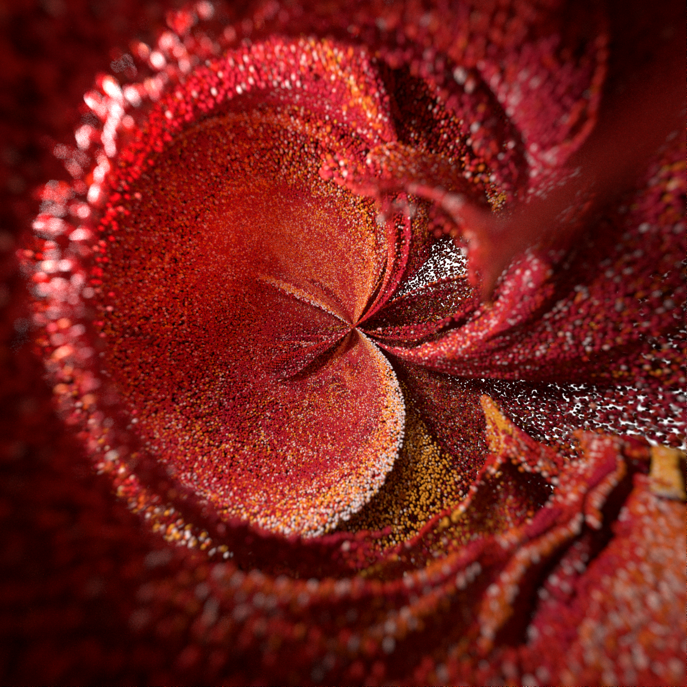

   
  
  
  

<!---------------------------------------------------------------------------------------------------------------------->

#  Polar Particles
This is an experiment with particles and polar coordinates, I tried to create an interesting animation by animating the U, V or Radius compounents of the Polar Coordinates

the particles were created with a particle simulation with pop force and axis force to make them spin around the Y axis.

Afterward I would normalize the Position attribute, convert it to polar cordiantes, add the world and polar position togerher, while animating the world position. 

Full Node Tree:

<!---------------------------------------------------------------------------------------------------------------------->

   I share my personal projects for free with everyone.

 

   You are welcome to explore all of them
   <a href="https://github.com/nitzan-treg/community_projects/">
      here
   </a>

 
   

